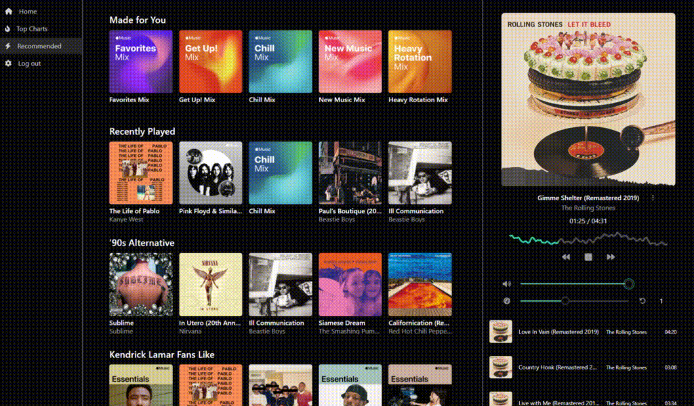

# Music Room

Not sure where this project is going yet. Currently, it is an integration with Apple Music.



# Usage

## Prerequisites

- Create an [Apple Developer account](https://developer.apple.com).
- Bun `npm i -g bun`
- [Install Go](https://go.dev/doc/install)

## Secrets Setup

1. Get the required credentials and ids for [creating an Apple Developer Token](https://developer.apple.com/documentation/musickit/using-automatic-token-generation-for-apple-music-api)
2. Create a .env file in ./server
3. Add the following variables filling in the information from step 1.

```text
# ./server/.env

SECRET_KEY_FILE_PATH="/path/to/secret/key/file"
ISSUER="**********" # Team ID
KID="**********" # Key ID
```

## Starting the Application

1. In the server directory, run the command `go run ./cmd/apple-music-api/main.go`
2. Create a new terminal in the client directory and run `bun dev`
